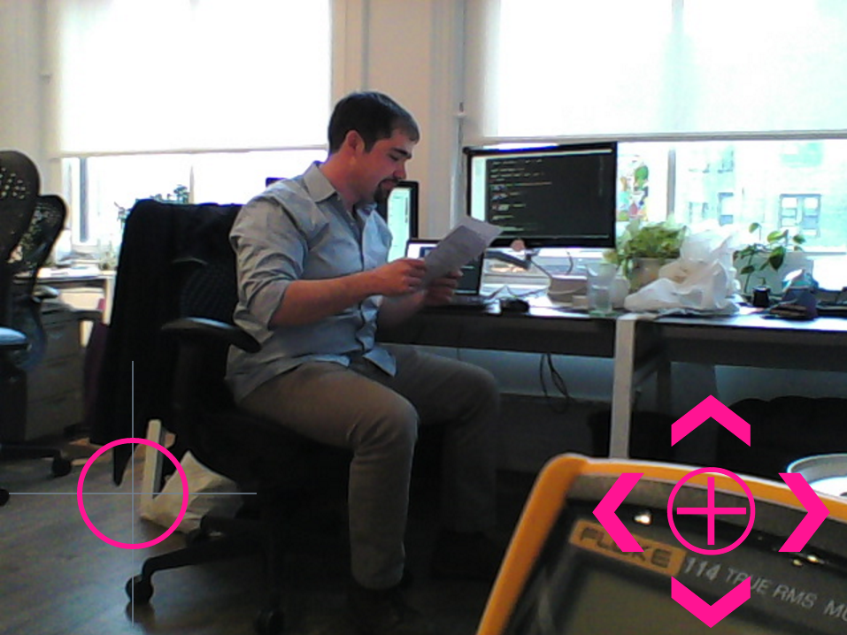

# reconbot

# Buy these parts
 - Robot base https://www.servocity.com/html/junior_runt_rovertm__637142_.html
 - H-Bridge https://www.pololu.com/product/2135
 - 12v power converter for eidson https://www.pololu.com/product/2577 
 - Pan/Tilt https://www.servocity.com/html/spt100_pan___tilt_system.html (for hi-tech servos)
 - Servos for Pan/Tilt https://www.servocity.com/html/hs-422_super_sport_.html (2x)
 - Intel Edison Arduino Breakout https://www.sparkfun.com/products/13097
 - Webcam https://www.amazon.com/dp/B0092QJRPC/
 - 2 cell Lipo https://www.amazon.com/dp/B0072AEHIC
 - 1 cell lipo?
 - Servo booster
 - Charger
 - Wires and clips

Follow the instructions from the [spark fun ubilinux install guide](https://learn.sparkfun.com/tutorials/loading-debian-ubilinux-on-the-edison) and stop before logging in the first time.

