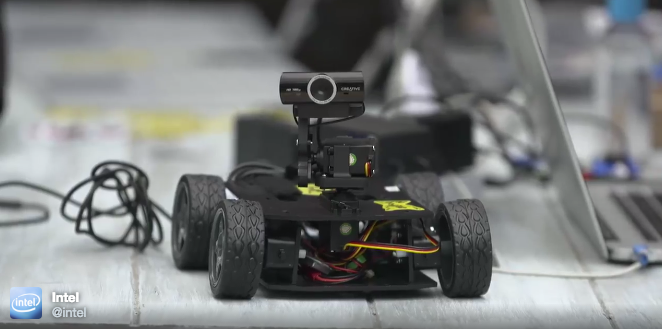

# Reconbot

Build your own Reconbot and drive it with your phone. Built for Intel by Bocoup, maintained by bocoup and the nodebots community.

# Buy these parts
 - Robot base https://www.servocity.com/html/junior_runt_rovertm__637142_.html
 - H-Bridge https://www.pololu.com/product/2135
 - 12v power converter for eidson https://www.pololu.com/product/2577
 - Pan/Tilt https://www.servocity.com/html/spt100_pan___tilt_system.html (for hi-tech servos)
 - Servos for Pan/Tilt https://www.servocity.com/html/hs-422_super_sport_.html (2x)
 - Intel Edison Arduino Breakout https://www.sparkfun.com/products/13097
 - Webcam https://www.amazon.com/dp/B0092QJRPC/
 - 2 cell Lipo https://www.amazon.com/dp/B0072AEHIC
 - 1 cell lipo
 - "Servo booster"
 - Charger
 - Wires and clips

## Software Setup and Install

There are two options for installing and running on the Intel Edison. You can use [ubilinux](http://www.emutexlabs.com/ubilinux) or [Resin.io](https://resin.io/). The code is the same for both.

 - ubilinux is an embedded Linux distribution from Emutex and is based on Debian
 - Resin is a "Modern development and deployment workflow for the Internet of Things" that lets you `git push` code changes to your Edison.

### ubiLinux Install

Follow the instructions from the [spark fun ubilinux install guide](https://learn.sparkfun.com/tutorials/loading-debian-ubilinux-on-the-edison) and stop just after logging in for the first time.

### Resin.io Install

 - Setup a resin.io account
 - flash your edison with the provided firmware
 - git push this repo into your project's remote repository
 - wait 5-10 minutes for it to download for the first time
 - Drive your robot around by browsing to it's IP address in the resin dashboard
