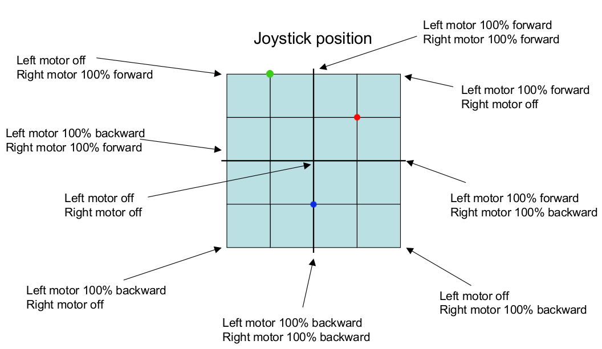

Specification: 

- Forward/reverse: keep both the left and right motors at the same speed.
- Turn: example... turn right at 90 deg, move the left motor "forward" at 100% speed and the right motor "reverse" at 100% speed. 





- X represents "turn"
- Y represents "forward/reverse"
- This is a differential drive, 
  - If no difference between left and right motors: "forward/reverse" with no turn. 
  - If the difference between left and right are maximum, then turn in place.
- If X is 0 then there is no difference between left and right values, follow Y. 
- If Y is 0, then the difference between left and right are maximum (which is 200 in this co-ordinate system).
- Within each quadrant, if the X and Y values are same, 
  - One or the other of the left/right motors would stop rotating and the other motor will take the value of Y.
- If the movement follows the X-axis plane, the "turn co-efficient" is maximum at 1 or -1. 
- If the movement follows the Y-axis plane, the "turn co-efficient” is 0. 
- Turn co-efficient varies from -1 to 1 within a span of 90 deg. 
  - At 45deg, the turn co-efficient is 0


```
(x, y)

-127,   0,127    127,
127              127
  \       |       /
   \      |      /
    \     |     /
     \    |    /
      \   |   /
       \  |  /
        \ | /
         \|/
-127,-----+-------127,
  0      /|\       0
        / | \
       /  |  \
      /   |   \
     /    |    \
    /     |     \
   /      |      \
  /       |       \
-127,   0,-127   127,
-127            -127
```
